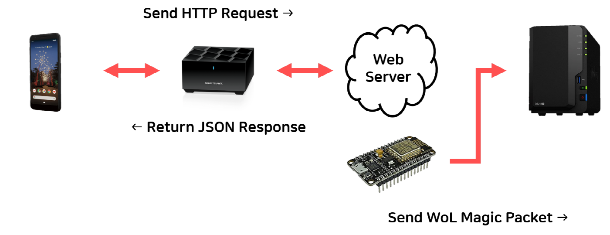
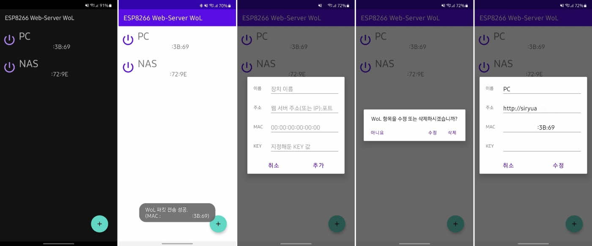

# ESP8266 웹서버 WOL
아두이노 기반 ESP8266 웹서버 및 WOL

## 기능
 * 웹서버 접속 정보 바탕으로 WOL 매직 패킷 전송
 
## 동작 개념도


## 안드로이드 앱
 
 
## 사용한 아두이노 라이브러리
 * [WakeOnLan](https://github.com/a7md0/WakeOnLan, "GitHub")
 * [base64](https://github.com/a7md0/WakeOnLan, "GitHub")

## 사용 시 수정이 필요로 한 코드
```
// Wi-Fi
const char*   WIFISSID    = "Your Wi-Fi SSID";      //Wi-Fi SSID
const char*   WIFIPASS    = "Your Wi-Fi Password";  // Wi-Fi 비밀번호

// 시리얼 모니터링
const bool    CONSOLE     = false;                  // 콘솔 출력 안하려면 false
const int     BANDRATE    = 115200;                 // 보드 설정에 맞추어서 수정

// 웹서버
const int     WEBPORT     = 80;                     // 접속 포트 설정
const String  WEBREDIRECT = "https://google.com";   // 리다이렉트 주소
const String  WEBKEY      = "ABCDEFGH";             // 구분자, 16자 이하 추천, 그 이상은 뻗음
const int     TOKEN_MAX_SIZE = 256;                 // 주고 받을 토큰 값 최대 크기, 최대 256까지만..
```

## 자세한 설명은 블로그 참고 부탁드립니다.
 * [ESP8266 WebServer Wol Post](https://brunch.co.kr/@searphiel9/321,"Kakao Brunch")

<br>

***

<br>

# ESP8266 WebServer WOL

## Function
 * WOL magic packet transmission based on web server access information

## Process Diagram


## Android App
 

## Arduino library used
 * [WakeOnLan](https://github.com/a7md0/WakeOnLan, "GitHub")
 * [base64](https://github.com/a7md0/WakeOnLan, "GitHub")

## Code requiring modification when using
```
// Wi-Fi
const char*   WIFISSID    = "Your Wi-Fi SSID";      //Wi-Fi SSID
const char*   WIFIPASS    = "Your Wi-Fi Password";  // Wi-Fi Password

// Serial Monitoring
const bool    CONSOLE     = false;                  // False to disable console output
const int     BANDRATE    = 115200;                 // Modify according to the board setting

// Web Server
const int     WEBPORT     = 80;                     // Connection port setting
const String  WEBREDIRECT = "https://google.com";   // Redirect address
const String  WEBKEY      = "ABCDEFGH";             // Separator, recommended 16 characters or less, extended beyond
const int     TOKEN_MAX_SIZE = 256;                 // The maximum size of the token value to be sent and received, only up to 256..
```

## Please refer to the blog for detailed explanation.
 * [ESP8266 WebServer Wol Post](https://brunch.co.kr/@searphiel9/321,"Kakao Brunch") (Korean)

<br>

***

<br>

## License
MIT ⓒ SiRyuA (HKB)